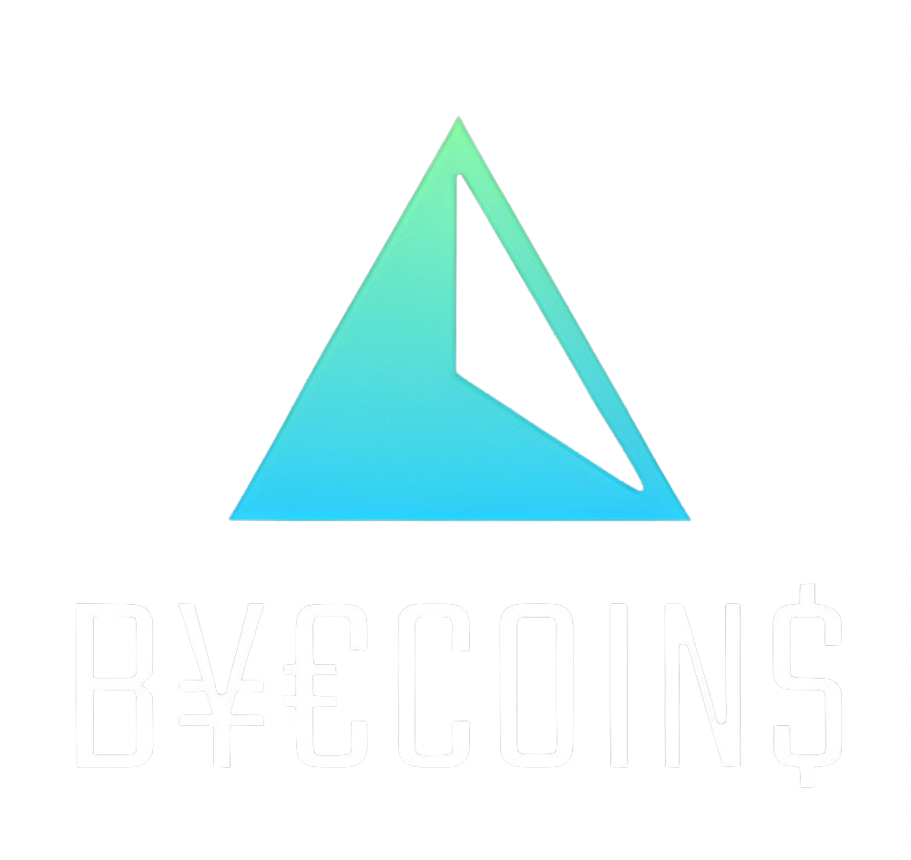

# B¥€COIN$


B¥€COIN$ - веб приложение p2p биржи по обмену криптовалюты.

Приложение развернуто на [GitHub Pages](https://kozhemyakinaelizaveta.github.io/byecoins/index.html).


Сделан по [макету](https://byecoins.nicepage.io/?version=6e8c6041-dca6-4494-ac94-88466957acfb).
```
git clone https://github.com/KozhemyakinaElizaveta/react-burger.git
cd byecoins-app
npm ci
npm start
```
##### Стек технологий
- HTML
- React
- JavaScript
- Redux
- Figma

<div align="left">
  <br/>
  &nbsp;
  &nbsp;
  &nbsp;
  &nbsp;
  &nbsp;
</div>